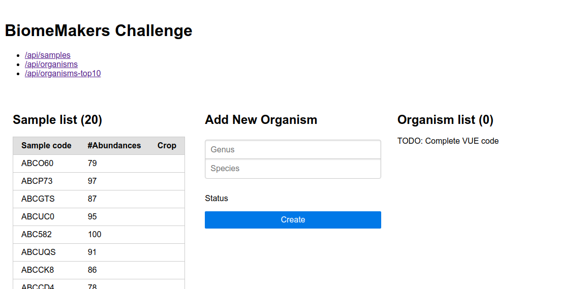

# BiomeMakers FullStack Challenge

## Introduction

In BiomeMakers we combine DNA sequencing, AI and AgData to identify
the microbial biomarkers providing insights to optimize the health of any crop.
The IT and Software department mission is to build the different Portals
to allow our clients to access their sample reports.
Moreover, we create internal tools for the other departments
(laboratory, bio-informatics, customer service, finance...)
to control the sample process and communicate with the clients. 

This repository contains a simulated portal with all the technology use
use on daily basics:
* Docker
* PHP
* Laravel
* PostgreSQL
* Typescript
* Vue

We will propose several small challenges to test your technical skills
and coding proficiency.

## Time limit

Feel free to complete any of the challenges
(you could add extra functionality if there is some skill you want to show us).
We value your time so this challenge should take about **1 hour** to complete it.

## Usage

All the software has been prepared inside a docker container so you 
**DO NOT NEED** to install anything except docker
and an IDE (we recommend Visual Studio Code).
The container will have the laravel server, a postgresql instance,
and a hot reloader webpack.
You need to ensure that the ports `8000`, `8001` and `8002`
are not being used.

To use it just execute `./run.sh` and navigate to `http://localhost:8000`

The run command will take several minutes (around 5 minutes) to complete the first time
it is executed because it has to create the full docker container. 

While the container is running you can use these commands
(not really needed until you want to use the artisan command
or run some SQL directly):
* `bash.sh`: Open a bash terminal in the container
* `psql.sh`: Open a sql terminal in the postgreSQL server

Note that the DB and the sessions are not persistent because they
are destroyed then the container ends.

## Description of the data model

The DB will contain a small version of the entities we work with in BiomeMakers.
They will be filled with test data.

* `crops(id, name)`: A list of crops
* `organisms(id, genus, species)`: Microorganism list
* `samples(id, code, crop_id)`:
A sample with a string code that is associated with a crop
* `abundances(id, sample_id, organism_id, num)`:
Abundance of a particular microorganism inside a sample

## Main page

The main page at `http://localhost:8000` will look like this:

## Challenges

### 1. Create a Laravel Model for the `crops` table

The other tables in the DB (`samples`, `organisms`, `abundances`)
have its correspondent laravel model, the model for the `crop`
table is missing although the table itself exists in the DB and have data.

* Create the `app/Models/Crop` class
* Create the relation `crop` in the `app/Models/Sample` model
* **[EXTRA]** Modify the endpoint `/api/samples` to include the crop name
* **[EXTRA]** Modify the `samples.vue` component to retrieve the crop name into the list

### 2. Complete endpoint to create a new organism (POST `/api/organisms`)

* The `new_organism.vue` will is currently calling this endpoint but it responds with an error
* The method is located at: `BiomeController@newOrganism`
* **[EXTRA]** Validate the request to ensure the data is not empty
* **[EXTRA]** Validate the input in the `new_organism.vue` before calling the endpoint

### 3. Complete the `organisms.vue` component

* This is similar to the `samples.vue` component
* It uses the endpoint `/api/organisms` (which is paginated)
* **[EXTRA]** Create a new component for each organism and pass it with vue props

### 4. Complete the endpoint `organisms-top10`

* This endpoint should return the top 10 most common organisms 
by the number of samples they appear
* Include the number of samples where they appear
* **[EXTRA]** Include the 3 most common crops for those organisms

## Useful links

* https://laravel.com/docs/8.x

## Notes 

This is not needed for the challenge
but it help to understand who this docker works.

About the docker:
* This docker copies some of the files inside the container
to install some of the software stuff.
When running it mounts the folder again so the vendor and
node_modules are in the host machine,
this was done to make the autocomplete of the IDE work
otherwise it will complain that the library classes are missing.
* Some directories are mounted as a volume,
this way the caches or log are keep inside the container
and they are removed with it.
* Port 8000 is used for the web server
* Port 8001 is used for the hot reloader of webpack
* Port 8002 is used for the PostgreSQL database.
In case you want to connect from outside the dbname/user/password is all `biome`. You can use the `psql.sh` script which is is simpler.